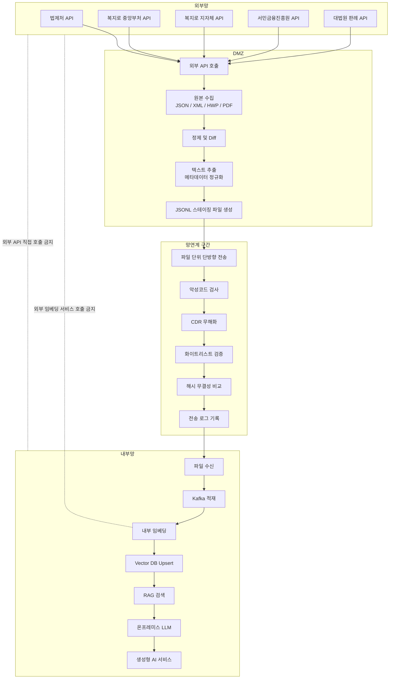

# 외부 API 원본 수집 시스템 (DMZ 단계)

> **목적** — 외부망 공공 API 5종에서 원본 데이터를 수집해 PostgreSQL에 저장하는 DMZ 구간 수집 모듈.
> Diff 수행 및 망연계 전송 전 단계까지만 구현한 테스트 버전입니다.

---

## 전체 아키텍처



**현재 구현 범위**: 수집 + PostgreSQL 원본 저장 (`Diff` 이전 단계)

---

## 수집 대상 API

| # | API | 제공기관 | 형식 | 인증키 |
|---|-----|---------|------|--------|
| 1 | 법제처 국가법령정보 (현행법령 본문) | 법제처 | XML | `LAW_OC_KEY` |
| 2 | 복지로 중앙부처복지서비스 | 한국사회보장정보원 | XML | `PUBLIC_API_KEY` |
| 3 | 복지로 지자체복지서비스 | 한국사회보장정보원 | XML | `PUBLIC_API_KEY` |
| 4 | 서민금융진흥원 대출상품한눈에 | 서민금융진흥원 | XML | `PUBLIC_API_KEY` |
| 5 | 법률 판례 | 법제처 | XML | `LAW_OC_KEY` |

---

## 디렉터리 구조

```
API_test/
├── docker-compose.yml          # PostgreSQL 16 컨테이너
├── init.sql                    # DB 테이블 초기화 DDL
├── pyproject.toml              # UV 패키지 관리
├── .env.example                # 환경 변수 템플릿
├── .env                        # 실제 환경 변수 (gitignore 권장)
│
├── config/
│   └── settings.py             # 환경 변수 로더 + API URL 상수
│
├── db/
│   ├── connection.py           # psycopg2 연결 팩토리
│   ├── schema.py               # 파이프라인 테이블 DDL (Python 실행)
│   └── items.py                # collection_items / collection_targets / documents CRUD
│
├── collectors/
│   ├── base.py                 # 공통 HTTP 요청, XML 파싱, 파이프라인 인터페이스(추상)
│   ├── law_text/
│   │   └── collector.py        # 법제처 현행법령 수집기
│   ├── welfare/
│   │   ├── central_collector.py  # 복지로 중앙부처 수집기
│   │   └── local_collector.py    # 복지로 지자체 수집기
│   ├── small_loan/
│   │   └── collector.py        # 서민금융진흥원 수집기 (목록/상세 미분리)
│   └── precedent/
│       └── collector.py        # 법률 판례 수집기
│
├── services/                   # 3단계 파이프라인 서비스 레이어
│   ├── discovery.py            # 목록 → collection_items
│   ├── targeting.py            # collection_items → collection_targets
│   └── sync.py                 # collection_targets → 상세 → documents
│
├── api/                        # FastAPI Swagger 인터페이스
│   ├── app.py                  # 앱 진입점 (uvicorn)
│   ├── deps.py                 # DB 의존성
│   ├── routes/                 # 도메인별 라우터
│   │   ├── _common.py          # targets/sync/items/documents 공통 등록
│   │   ├── law_text.py
│   │   ├── precedent.py
│   │   ├── welfare_central.py
│   │   ├── welfare_local.py
│   │   └── small_loan.py
│   └── schemas/                # Pydantic 요청/응답 스키마
│       ├── requests.py         # 도메인별 요청 파라미터 (Swagger 문서화)
│       └── responses.py
│
└── main.py                     # 파이프라인 CLI (discover / targets / sync)
```

---

## 빠른 시작

### 1. PostgreSQL 컨테이너 실행

```bash
docker compose up -d
```

컨테이너가 정상 기동되면 `api_test_db` 이름으로 PostgreSQL이 `localhost:5432`에 바인딩됩니다.

```bash
# 상태 확인
docker compose ps

# 로그 확인
docker compose logs -f postgres
```

### 2. Python 환경 설정 (UV)

```bash
# 의존성 설치 — .venv 생성 + uv.lock 기록
uv sync
```

### 3. ENV 설정

`.env` 파일을 만들어 API 키를 입력합니다.

| 변수명 | 설명 | 발급처 |
|--------|------|--------|
| `PUBLIC_API_KEY` | 복지로·서민금융진흥원 공통 키 | [data.go.kr](https://www.data.go.kr) 마이페이지 → 개발계정 |
| `LAW_OC_KEY` | 법제처 법령·판례 API 키 | [open.law.go.kr](https://open.law.go.kr) 이용신청 |


### 4. API 서버 실행 (Swagger)

```bash
uv run uvicorn api.app:app --reload --host 0.0.0.0 --port 8000
```

- Swagger UI: <http://localhost:8000/docs>
- 서버 기동 시 파이프라인 테이블이 자동 생성됩니다 (`ensure_schema()`).

### 5. (선택) CLI 실행 — HTTP 없이 터미널/배치(cron)

`main.py` 는 API 서버와 **동일한 services 레이어**를 호출합니다.

```bash
# SOURCE STAGE [옵션]   (STAGE: discover | targets | sync | all)

# 목록 수집 (필터 지정)
uv run python main.py law_text discover --filter query=근로기준법 --filter search=1
uv run python main.py welfare_local discover --filter region_name=서울특별시 --filter search_word=청년

# 동기화 대상 등록 → 상세 수집
uv run python main.py law_text targets --register-all
uv run python main.py law_text sync --limit 20
uv run python main.py law_text sync --force        # 이미 수집된 것도 재수집

# discover → targets → sync 일괄
uv run python main.py small_loan all --filter usge=생계
```

> `--filter` 키는 각 수집기 `fetch_list()` 파라미터명(아래 "도메인별 주요 필터")을 사용합니다.

---

## 설계 원칙 — 원본 전체 보존 + 공통 처리

각 도메인 API 의 응답 형식은 모두 다르지만, **수집 원본은 형식 그대로 JSONB 에 통째로 저장**하고
파이프라인·테이블·엔드포인트는 전부 공통으로 처리합니다.

| 구분 | 내용 | 도메인별 여부 |
|------|------|:---:|
| `collection_items.list_payload` | 목록 응답 item **전체** (필드 누락 없이 원본 보존) | 공통 |
| `documents.raw_payload` | 상세 응답 **원본 전체** | 공통 |
| 테이블·3단계 파이프라인·모든 엔드포인트 | discover / targets / sync / 조회 | 공통 |
| `get_external_id` · `get_title` · `normalize_list_item` · `normalize_detail` | 그 도메인 필드명을 아는 **추출·정제** | **도메인별** |
| `fetch_list` · `fetch_detail` 파라미터·엔드포인트 | API 호출부 | **도메인별** |

즉 도메인 고유 코드는 **① API 호출부 + ② normalize 메서드** 2가지뿐입니다.
공통 필드(`external_id` / `title` / `normalized_text` / `metadata`)만 뽑아내고,
손실 없는 원본은 `list_payload` / `raw_payload` 에 그대로 보존합니다.

---

## 3단계 수집 파이프라인

기존 "한 번에 목록+상세 저장" 방식을 **Discovery → Targeting → Sync** 3단계로 분리했습니다.
각 단계는 도메인별 REST 엔드포인트로 제공됩니다.

```
① Discovery   목록 API 호출 → collection_items 저장
              POST /{domain}/discover
              - 식별자(external_id) + 제목 + 목록 payload 전체 보존
              - 재현용 요청 파라미터(discovered_query) 동시 기록
                ※ 실제 사용한(null 제외) 검색 조건만 저장

② Targeting   collection_items → collection_targets 등록
              POST /{domain}/targets
              - 정기 동기화 대상(master) 선별
              - register_all=false(기본): 아직 targets 에 없는 신규 항목만
              - register_all=true       : collection_items 전체 재등록

③ Sync        collection_targets → 상세 API → documents 저장
              POST /{domain}/sync
              - content_hash(SHA256) 비교로 insert / update / unchanged 판정
              - 변경 시 이전 버전을 document_versions 에 이력 보존
              - normalized_text(RAG/검색용) + raw_payload(원본 보존) 동시 저장
```

각 단계 응답은 처리 건수와 샘플을 포함합니다.

### Targeting 옵션 (`POST /{domain}/targets`)

| 옵션 | 기본값 | 설명 |
|------|--------|------|
| `register_all` | `false` | true=collection_items 전체 등록(재등록 포함), false=신규 항목만 |
| `limit` | `null` | 등록할 최대 건수 (테스트용) |
| `only_active_items` | `true` | true=status='ACTIVE' 인 항목만 대상 |

### Sync 대상 선별 정책 (`POST /{domain}/sync`)

기본은 **아직 상세 수집이 안 된 pending 대상부터** 처리합니다.
(예: targets 1~20 중 1~10 이 이미 documents 에 있으면 11~20 을 우선 sync)

| 옵션 | 기본값 | 설명 |
|------|--------|------|
| `limit` | `5` | 이번 sync 에서 처리할 최대 건수 |
| `pending_only` | `true` | true=`last_detail_collected_at` 이 NULL 이거나 documents 행이 없는 대상만 |
| `force_resync` | `false` | true=이미 동기화된 대상도 상세 API 재호출 → hash 비교(동일=unchanged, 변경=updated) |
| `stale_after_days` | `null` | 마지막 동기화가 N일보다 오래된 대상도 재동기화 대상에 포함 |

**Sync 응답 카운트**

| 필드 | 설명 |
|------|------|
| `target_count` | 전체 ACTIVE target 수 |
| `pending_count` | 실행 후 잔여 pending target 수 |
| `synced_count` | 이번 실행 처리 건수 (= inserted+updated+unchanged) |
| `inserted_count` / `updated_count` / `unchanged_count` / `failed_count` | 처리 결과별 건수 |

### 도메인 엔드포인트

| 도메인 | prefix | 목록/상세 분리 |
|--------|--------|----------------|
| 법제처 법령 | `/law_text` | ✅ |
| 법제처 판례 | `/precedent` | ✅ |
| 복지로 중앙부처 | `/welfare_central` | ✅ |
| 복지로 지자체 | `/welfare_local` | ✅ |
| 서민금융 대출상품 | `/small_loan` | ❌ (단일 조회) |

각 도메인 공통 엔드포인트:

| 메서드 | 경로 | 설명 |
|--------|------|------|
| POST | `/{domain}/discover` | 목록 수집 → collection_items |
| POST | `/{domain}/targets` | 대상 등록 → collection_targets |
| POST | `/{domain}/sync` | 상세 수집 → documents |
| GET | `/{domain}/items` | collection_items 조회 |
| GET | `/{domain}/targets` | collection_targets 조회 |
| GET | `/{domain}/documents/{external_id}` | documents 상세 조회 |

> **대출상품(`/small_loan`)** 은 API 가 목록/상세를 분리하지 않습니다. sync 단계는 별도 API
> 호출 없이 `collection_items.list_payload` 를 정규화하여 documents 에 저장합니다.
> `POST /small_loan/collect_all` 로 discover→targets→sync 를 한 번에 실행할 수 있습니다.

### 호출 예시 (curl)

```bash
# ① 법령 목록 수집 (법령명 검색, 시행일 내림차순)
curl -X POST http://localhost:8000/law_text/discover \
  -H 'Content-Type: application/json' \
  -d '{"query":"근로기준법","display":10,"search":1,"sort":"efdes"}'

# ② 수집된 항목을 동기화 대상으로 등록
curl -X POST http://localhost:8000/law_text/targets \
  -H 'Content-Type: application/json' -d '{"limit":null}'

# ③ 상세 본문 수집 → documents 저장
curl -X POST http://localhost:8000/law_text/sync \
  -H 'Content-Type: application/json' -d '{"limit":5}'

# 판례 — 대법원 손해배상 판례, 선고일자 내림차순
curl -X POST http://localhost:8000/precedent/discover \
  -H 'Content-Type: application/json' \
  -d '{"query":"손해배상","court_org":"400201","sort":"ddes","display":10}'

# 대출상품 — 3단계 일괄 실행
curl -X POST http://localhost:8000/small_loan/collect_all \
  -H 'Content-Type: application/json' -d '{"display":50,"usge":"생계"}'
```

---

## 도메인별 주요 필터 파라미터

모든 파라미터는 Swagger UI 의 요청 스키마에 설명과 함께 노출됩니다.

### `/law_text` (법제처 법령)
`query`(검색어) · `search`(1=법령명/2=본문) · `display` · `page` · `sort`(efdes 등) ·
`nw`(연혁/현행) · `org`(소관부처코드) · `knd`(법령종류) · `ef_yd`·`anc_yd`·`anc_no`(범위검색) ·
`date` · `rr_cls_cd`(제개정종류) · `nb`(공포번호) · `gana` · `lid`

### `/precedent` (법제처 판례)
`query` · `search`(1=판례명/2=본문) · `display` · `court_org`(400201=대법원) ·
`court_name`(법원명) · `ref_law`(참조법령) · `sort`(ddes 등) · `prnc_yd`(선고일자 범위) ·
`case_no`(사건번호) · `data_src_nm`(출처) · `prec_type`(판결/결정/명령) · `gana` · `date`

### `/welfare_central` (복지로 중앙부처)
`srch_key_code`(001=제목/002=내용/003) · `search_word` · `display` · `life_array`(생애주기) ·
`target_group`(가구유형) · `intr_thema`(관심주제) · `age` · `online_apply_yn`(Y/N) ·
`order_by`(date/popular)

### `/welfare_local` (복지로 지자체)
`region_name`(시도명, **이름**) · `city_name`(시군구명, **이름**) · `srch_key_code` ·
`search_word` · `display` · `life_array` · `target_group` · `intr_thema` · `age` · `sort_order`

### `/small_loan` (서민금융 대출상품)
`irt_ctg`(금리구분) · `usge`(용도) · `inst_ctg`(기관구분) · `rsd_area`(거주지역) ·
`tgt_fltr`(대상) · `prd_ctg`(상품구분) · `display`

---

## DB 테이블 구조

파이프라인 테이블 4개로 구성됩니다 (`collection_items` → `collection_targets` → `documents` → `document_versions`).
도메인 구분 없이 `source` 컬럼으로 구분하며, 원본은 JSONB(`list_payload` / `raw_payload`)에 통째로 보존합니다.

### `collection_items` — Discovery 결과 (목록 원본)

| 컬럼 | 타입 | 설명 |
|------|------|------|
| `source` | VARCHAR(50) | 도메인 (law_text / precedent / …) |
| `external_id` | VARCHAR(200) | API 식별자 (법령일련번호/servId/seq 등) |
| `title` | TEXT | 제목 |
| `list_payload` | JSONB | 목록 응답 item 전체 (필드 누락 없이 보존) |
| `discovered_query` | JSONB | 수집 시 실제 사용한 검색 조건 (null 제외, 재현용) |
| `status` | VARCHAR(20) | ACTIVE / INACTIVE |
| `last_seen_at` | TIMESTAMP | 마지막 목록 확인 시각 |
| — | — | UNIQUE (source, external_id) |

### `collection_targets` — Targeting 결과 (정기 동기화 대상 master)

| 컬럼 | 타입 | 설명 |
|------|------|------|
| `source` / `external_id` | — | collection_items 와 동일 키 |
| `title` | TEXT | 제목 |
| `collect_detail` | BOOLEAN | 상세 수집 여부 (기본 TRUE) |
| `last_detail_collected_at` | TIMESTAMP | 마지막 sync 시각 (NULL=미수집) |
| `status` | VARCHAR(20) | ACTIVE / INACTIVE |

### `documents` — Sync 결과 (정제 문서, 최신본)

| 컬럼 | 타입 | 설명 |
|------|------|------|
| `source` / `external_id` | — | UNIQUE 키 |
| `title` | TEXT | 제목 |
| `content_hash` | VARCHAR(64) | normalized_text 의 SHA256 (변경 감지) |
| `raw_payload` | JSONB | 상세 응답 원본 전체 |
| `normalized_text` | TEXT | RAG/검색용 정제 텍스트 |
| `metadata` | JSONB | 주요 메타 필드 |
| `version` | INTEGER | 변경 시 1씩 증가 |

### `document_versions` — 문서 변경 이력

| 컬럼 | 타입 | 설명 |
|------|------|------|
| `document_id` | INTEGER FK | documents.id 참조 |
| `content_hash` / `raw_payload` / `normalized_text` / `metadata` / `version` | — | 변경 직전 스냅샷 |

> **변경 감지 로직**: sync 시 `normalized_text` 의 SHA256 를 기존 `content_hash` 와 비교 →
> 신규(insert) / 동일(unchanged) / 변경(이전 버전을 document_versions 에 보존 후 update).

---

## 수집 결과 확인 (psql)

```bash
# DB 접속
docker exec -it api_test_db psql -U apitest -d api_collect
```

```sql
-- 파이프라인: 도메인별 수집 현황
SELECT source, COUNT(*) FROM collection_items GROUP BY source;
SELECT source, COUNT(*) FROM collection_targets GROUP BY source;
SELECT source, COUNT(*), MAX(version) FROM documents GROUP BY source;

-- 파이프라인: 정제 문서 확인
SELECT source, external_id, title, version, content_hash
FROM documents ORDER BY updated_at DESC LIMIT 10;

-- 파이프라인: 변경 이력
SELECT document_id, source, external_id, version, created_at
FROM document_versions ORDER BY created_at DESC LIMIT 10;

-- 수집된 목록(collection_items) 확인 — 도메인별
SELECT external_id, title, last_seen_at
FROM collection_items
WHERE source = 'welfare_local'
ORDER BY last_seen_at DESC LIMIT 10;

-- 정제 문서(documents) 확인
SELECT source, external_id, title, version, content_hash
FROM documents
WHERE source = 'law_text'
ORDER BY updated_at DESC LIMIT 10;

-- 정제 본문(normalized_text) 일부 보기
SELECT title, left(normalized_text, 200) AS preview
FROM documents WHERE source = 'precedent' LIMIT 5;

-- 원본 payload 의 JSONB 필드 꺼내기 (도메인 필드명 그대로)
SELECT title,
       raw_payload->>'soDeptNm'  AS 소관부처,
       metadata->>'enforcement_date' AS 시행일
FROM documents WHERE source = 'law_text' LIMIT 5;

-- 목록 payload 에서 특정 지역 필터 (지자체)
SELECT title, list_payload->>'ctpvNm' AS 시도, list_payload->>'sggNm' AS 시군구
FROM collection_items
WHERE source = 'welfare_local' AND list_payload->>'ctpvNm' = '서울특별시'
LIMIT 10;
```

---

## 환경 변수 전체 목록

| 변수 | 기본값 | 설명 |
|------|--------|------|
| `POSTGRES_HOST` | `localhost` | DB 호스트 |
| `POSTGRES_PORT` | `5432` | DB 포트 |
| `POSTGRES_USER` | `apitest` | DB 사용자 |
| `POSTGRES_PASSWORD` | `apitest1234` | DB 비밀번호 |
| `POSTGRES_DB` | `api_collect` | DB 이름 |
| `PUBLIC_API_KEY` | — | data.go.kr 인증키 (복지로·서민금융진흥원) |
| `LAW_OC_KEY` | — | law.go.kr OC 키 (법제처 법령·판례) |
| `COLLECT_PAGE_SIZE` | `10` | discover 시 display 미지정 기본 페이지 크기 |
| `REQUEST_DELAY_SECONDS` | `0.5` | sync 상세 호출 간 딜레이 (초) |

---

## 중앙부처 vs 지자체 API 주요 차이

| 항목 | 중앙부처 | 지자체 |
|------|---------|--------|
| 목록 엔드포인트 | `NationalWelfarelistV001` | `LcgvWelfarelist` |
| 상세 엔드포인트 | `NationalWelfaredetailedV001` | `LcgvWelfaredetailed` |
| `callTp` 파라미터 | 필수 (L=목록, D=상세) | 없음 |
| `srchKeyCode` | 필수 (001/002/003) | 선택 |
| 정렬 파라미터 | `orderBy` (date/popular) | `arrgOrd` |
| 지역 필터 | 없음 (전국) | `ctpvNm`+`sggNm` (이름 문자열) |
| 총 서비스 수 | ~452건 | ~4,500건 |

> **주의**: 지자체 지역 필터는 코드(11, 31 등)가 아닌 **이름**(서울특별시, 경기도)으로 전달

---

## 다음 단계 (미구현)

- [ ] **Diff** — 이전 수집본 대비 변경 항목 추출
- [ ] **텍스트 추출** — HWP/PDF 원본에서 텍스트 변환
- [ ] **JSONL 스테이징** — 망연계 전송용 파일 생성
- [ ] **망연계 (MCCUBE)** — 내부망으로 단방향 파일 전송
