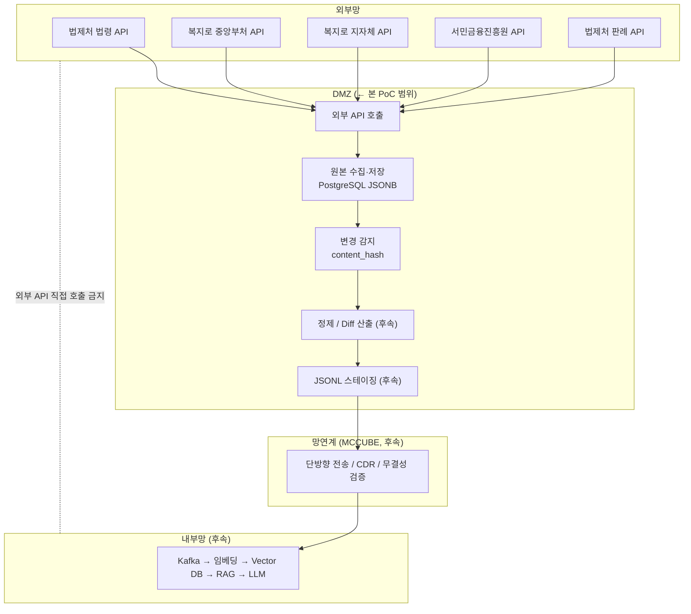

# 외부 API 원본 수집 시스템 — DMZ 단계 PoC

외부망 공공 API 5종의 원본 데이터를 PostgreSQL에 수집·저장하는 PoC
**외부 API 수집 → 원본 저장 → 변경 감지**까지 검증

## 문서

| 문서 | 내용 |
|------|------|
| **Swagger UI** — `http://localhost:8000/docs` | 엔드포인트·파라미터·요청 예시 (실행 후 접속) |
| [docs/DESIGN.md](docs/DESIGN.md) | 데이터 모델, DB 다이어그램, 저장 규칙, 변경 감지 로직 |
| 본 README | 개요·아키텍처·엔드포인트 요약·실행 방법 |

## 범위

- **구현**: 외부 API 호출, 목록/상세 수집, PostgreSQL 원본 저장(JSONB), `content_hash` 기반 변경 감지, 변경 이력 보존
- **후속**: Diff 산출물(JSONL) 생성, MCCUBE 망연계 전송, 내부망 Kafka·임베딩·Vector DB·RAG

---

## 아키텍처



---

## 수집 파이프라인

도메인이 달라도 저장 구조와 흐름은 공통이며, 3단계로 구성된다.
데이터는 `collection_items → collection_targets → documents → document_versions` 순으로 흐른다.

| 단계 | 엔드포인트 | 처리 |
|------|-----------|------|
| ① Discovery | `POST /{domain}/discover` | 목록 API 호출 → `collection_items` 저장 |
| ② Targeting | `POST /{domain}/targets` | 수집분 중 동기화 대상 선별 → `collection_targets` 등록 |
| ③ Sync | `POST /{domain}/sync` | 상세 API 호출 → `documents` 저장 + 변경 감지 |

### 핵심 동작 (요약)

- **저장 단위는 항목 1건**(`source`+`external_id`)이다. 한 검색에 N건이 잡히면 N개 행으로 저장되고
  (예: `근로기준법`·`시행령`·`시행규칙`은 별개 법령 → 3행), 같은 항목을 다시 받으면 `upsert`로 갱신해 **중복이 쌓이지 않는다.**
- **원본은 통째로 보존한다.** 목록 응답은 `list_payload`, 상세 응답은 `raw_payload`에 JSONB로 저장하고,
  `external_id`·`title`은 조회 편의를 위해 꺼내둔 요약 컬럼이다.
- **변경 감지(diff)는 해시로 한다.** 상세 본문을 정제한 `normalized_text`의 SHA256(`content_hash`)을 기존과 비교해
  신규/동일/변경을 판정하고, 변경 시 이전 버전을 `document_versions`에 보존한다. (이미 받은 문서 재검사는 `force_resync=true`)
- **`limit`은 폐기 기준이 아니라 1회 배치 크기**다. 미수집 대상부터 처리하며, 더 받으려면 `limit`을 올리거나 반복 호출한다.

> 데이터 모델·DB 다이어그램·저장 규칙·변경 감지 로직의 **상세는 [docs/DESIGN.md](docs/DESIGN.md)** 참고.

---

## 도메인 & 엔드포인트

| Prefix | 대상 | 목록/상세 |
|--------|------|:---:|
| `/law_text` | 법제처 현행법령 | 분리 |
| `/precedent` | 법제처 판례 | 분리 |
| `/welfare_central` | 복지로 중앙부처 복지서비스 | 분리 |
| `/welfare_local` | 복지로 지자체 복지서비스 | 분리 |
| `/small_loan` | 서민금융 대출상품 | 미분리 |

공통 엔드포인트 (파라미터 상세는 Swagger):

| 메서드 | 경로 | 설명 |
|--------|------|------|
| POST | `/{domain}/discover` | 목록 수집 → `collection_items` |
| POST | `/{domain}/targets` | 대상 등록 → `collection_targets` |
| POST | `/{domain}/sync` | 상세 수집 → `documents` (+변경 감지) |
| GET | `/{domain}/items` · `/targets` · `/documents/{external_id}` | 조회 |

- `/small_loan`은 목록/상세 미분리 API이므로 sync가 `list_payload`를 정제해 저장하며, `POST /small_loan/collect_all`로 3단계를 일괄 실행한다.

---

## 실행 방법

```bash
# 1. PostgreSQL (Docker)
docker compose up -d                       # api_test_db, localhost:5432

# 2. Python 환경 (UV)
uv sync

# 3. API 서버 → Swagger (http://localhost:8000/docs, 기동 시 테이블 자동 생성)
uv run uvicorn api.app:app --reload --host 0.0.0.0 --port 8000

# 4. (선택) CLI — HTTP 없이 터미널/배치
#    SOURCE STAGE [옵션]   STAGE: discover | targets | sync | all
uv run python main.py law_text all --filter query=근로기준법 --filter search=1
```

### 환경 변수 (`.env`)

| 변수 | 설명 |
|------|------|
| `PUBLIC_API_KEY` | 복지로·서민금융진흥원 공통 키 (data.go.kr) |
| `LAW_OC_KEY` | 법제처 법령·판례 OC 키 (open.law.go.kr) |
| `POSTGRES_HOST/PORT/USER/PASSWORD/DB` | DB 접속 정보 (로컬 기본값 제공) |

> `.env`는 키·비밀번호를 포함하므로 Git에 커밋하지 않는다 (`.gitignore` 처리됨).

---

## 다음 단계 (운영 전환 시)

**대량·자동 수집**
- 자동 페이지네이션(전체 백필) — 현재 discover는 1회 1페이지만 수집
- cron/스케줄러 — discover·sync 주기 실행, `pending_count=0`까지 반복
- sync 기본값 운영화 — `limit` 상향 또는 백그라운드/워커 처리
- 상태(status) 관리 — 소스 상태값 기반 활성/만료 처리 (정책 확정 후)

**DMZ 후속 → 내부망**
- 변경분 Diff 산출물(JSONL) 생성 → HWP/PDF 텍스트 추출 → JSONL 스테이징
- MCCUBE 망연계 전송 → Kafka 적재 → 임베딩 → Vector DB → RAG → 온프레미스 LLM
