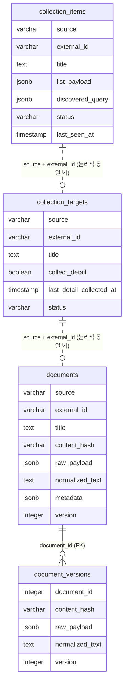

# 설계 문서 — 데이터 모델 및 수집 동작

본 문서는 수집 파이프라인의 데이터 모델과 핵심 동작 규칙을 기술한다.
실행 방법·엔드포인트 목록은 [README](../README.md)와 Swagger UI(`/docs`)를 참고한다.

---

## 1. 데이터 모델

테이블은 4개이며, 도메인 구분은 `source` 컬럼으로 처리한다.
API 응답 원본은 JSONB로 보존하고, 핵심 테이블은 `UNIQUE(source, external_id)`로 항목을 식별한다.



> `collection_items → collection_targets → documents`는 외래키가 아니라 **`(source, external_id)` 논리 키**로 연결된다.
> `document_versions`만 `documents.id`를 외래키로 참조한다.

### 1.1 테이블 상세

#### `collection_items` — Discovery 결과 (목록 후보)

| 컬럼 | 타입 | 설명 |
|------|------|------|
| `source` | VARCHAR(50) | 도메인 (law_text / precedent / …) |
| `external_id` | VARCHAR(200) | API 식별자 (법령일련번호 / servId / seq) |
| `title` | TEXT | 제목 |
| `list_payload` | JSONB | 목록 응답 item 원본 전체 |
| `discovered_query` | JSONB | 마지막 수집 시 사용한 검색 조건 (추적용) |
| `status` | VARCHAR(20) | ACTIVE / INACTIVE (현재 ACTIVE 고정) |
| `last_seen_at` | TIMESTAMP | 마지막 목록 확인 시각 |
| — | — | UNIQUE (source, external_id) |

#### `collection_targets` — 동기화 대상 master

| 컬럼 | 타입 | 설명 |
|------|------|------|
| `source`, `external_id` | — | collection_items와 동일 식별 키 |
| `title` | TEXT | 제목 |
| `collect_detail` | BOOLEAN | 상세 수집 여부 (기본 TRUE) |
| `last_detail_collected_at` | TIMESTAMP | 마지막 sync 시각 (NULL = 미수집) |
| `status` | VARCHAR(20) | ACTIVE / PAUSED (현재 ACTIVE 고정) |
| — | — | UNIQUE (source, external_id) |

#### `documents` — 상세 문서 최신본

| 컬럼 | 타입 | 설명 |
|------|------|------|
| `source`, `external_id` | — | UNIQUE 식별 키 |
| `title` | TEXT | 제목 |
| `content_hash` | VARCHAR(64) | `normalized_text`의 SHA256 (변경 감지 기준) |
| `raw_payload` | JSONB | 상세 응답 원본 전체 |
| `normalized_text` | TEXT | 검색/RAG용 정제 본문 |
| `metadata` | JSONB | 주요 메타데이터 (제목·기관·일자 등) |
| `version` | INTEGER | 문서 버전 (변경 시 +1) |

#### `document_versions` — 변경 이력

| 컬럼 | 타입 | 설명 |
|------|------|------|
| `document_id` | INTEGER FK | `documents.id` 참조 |
| `content_hash`, `raw_payload`, `normalized_text`, `metadata`, `version` | — | 변경 직전 스냅샷 |

---

## 2. 저장 규칙

### 2.1 저장 단위

- 저장 단위는 **API 고유 식별자(`external_id`) 1건 = 1행**이다.
- 목록 검색 결과 N건은 N개 행으로 저장된다.
  예: `근로기준법` / `근로기준법 시행령` / `근로기준법 시행규칙`은 별개 법령(일련번호 상이) → 3행.
- 동일 `(source, external_id)` 재수집 시 신규 생성하지 않고 **upsert(갱신)** 한다. 중복 누적 없음.

### 2.2 `collection_items` 행 구성

| 구분 | 컬럼 | 용도 |
|------|------|------|
| 요약 컬럼 | `external_id`, `title` | `list_payload`에서 추출. 조회·조인 편의 |
| 원본 | `list_payload` | "무엇을" 수집했나 — 목록 응답 item 전체 |
| 검색 조건 | `discovered_query` | "어떤 질의로" 수집했나 — 추적·감사용 |

- `discovered_query`는 현재 판단 로직에서 사용하지 않으며(조회 응답에만 포함), 재수집 시 최신 검색으로 덮어쓴다.

---

## 3. 변경 감지 (Diff)

Sync 단계에서 상세 본문을 정제(`normalized_text`)하고, 그 **SHA256(`content_hash`)** 를 기존 값과 비교한다.

```
1. 상세 응답 → normalized_text 생성 → content_hash = SHA256(normalized_text)
2. (source, external_id)로 기존 documents 조회
3. 없음            → INSERT (version=1)                  → inserted
4. 있음 / hash 동일 → 변경 없음                            → unchanged
5. 있음 / hash 상이 → 기존본을 document_versions에 보존 후   → updated
                     documents를 새 내용으로 갱신, version +1
```

- `documents` = 최신본, `document_versions` = 변경 직전 스냅샷(이력).
- 비교 대상은 정제 본문(`normalized_text`)이며 `raw_payload`(원본)가 아니다.
- 기존 문서를 재검사해 변경을 감지하려면 sync 시 `force_resync=true`가 필요하다
  (기본 동작은 미수집 대상만 처리하므로 기존 문서를 다시 조회하지 않음).

---

## 4. Sync 대상 선별

정렬 기준: `last_detail_collected_at ASC NULLS FIRST` — **미수집 우선, 그다음 오래된 순**.

| 옵션 | 기본 | 의미 |
|------|------|------|
| `limit` | 5 | 1회 처리 **배치 크기** (필터/폐기가 아님) |
| `pending_only` | true | 미수집(`last_detail_collected_at` NULL 또는 documents 부재) 대상만 |
| `force_resync` | false | 이미 수집된 대상도 상세 재호출 후 hash 비교 |
| `stale_after_days` | null | 마지막 수집이 N일 경과한 대상도 포함 |

응답 카운트: `target_count`, `pending_count`(잔여), `synced_count`, `inserted_count`, `updated_count`, `unchanged_count`, `failed_count`.

---

## 5. 전체 적재 vs 키워드 수집

- **전체 적재**: 키워드 없이 `page`를 끝까지 증가시켜 목록 전체를 순회한다.
  현재 discover는 1회 1페이지만 수집하며, 자동 전체순회는 미구현이다.
- **키워드 수집**: 특정 주제만 부분 수집할 때 사용한다.

---

## 6. 상태(status) 관리 — 미구현 (설계 노트)

- `status` 컬럼은 정의돼 있으나 **비활성화 정책 미확정으로 구현하지 않았다.** 전 행 ACTIVE로 동작한다.
- **목록 부재(absence) 기반 비활성화는 채택하지 않는다.** 부분 수집(1페이지/키워드)과 결과 비결정성으로 인해
  "목록에 안 보임 ≠ 삭제"이기 때문이다.
- 권장 방식: 소스가 제공하는 상태값을 사용한다.
  법령은 `현행연혁코드`(현행/연혁)·`제개정구분명`(…/폐지), 복지서비스는 시행 종료일 등.
